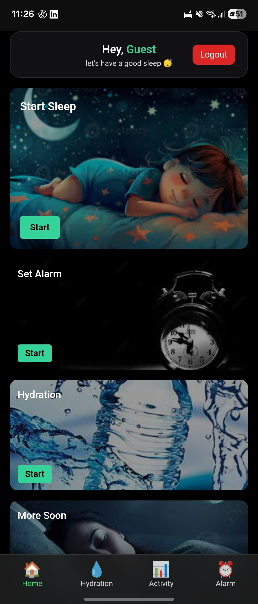
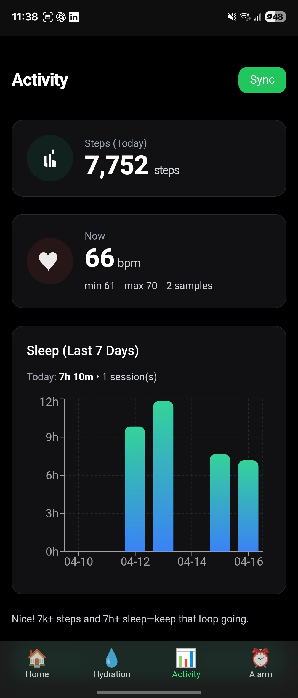
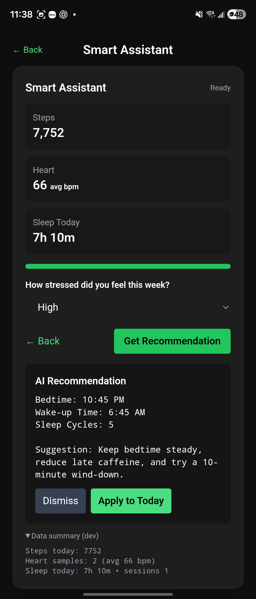
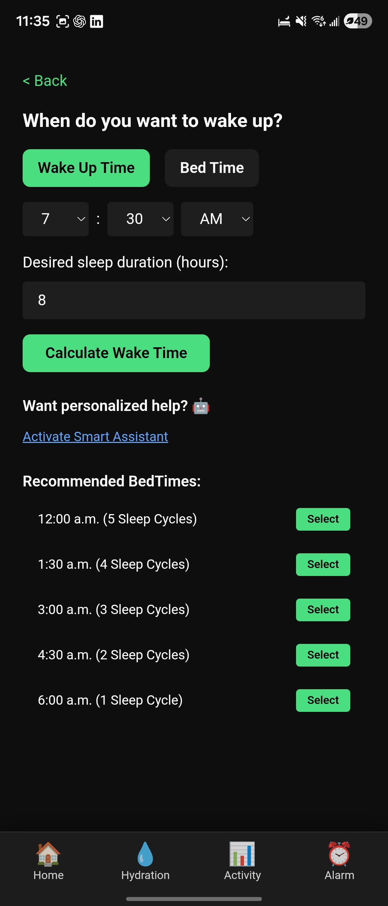
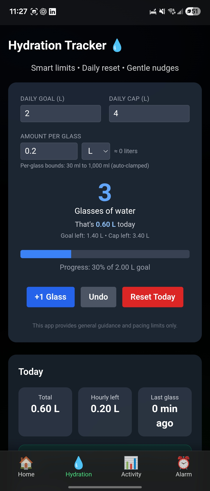
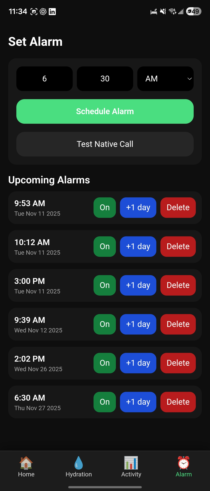

# ZyleSleep

ZyleSleep is a sleep tracking and wellness mobile app built using React and Capacitor.  
The app helps users monitor sleep habits, connect health-related data, and view useful wellness features in a simple and user-friendly interface.

## Features

- Sleep tracking
- Health Connect integration
- AI-based wellness or sleep recommendation screen
- Hydration tracking
- Alarm feature
- Mobile-friendly interface
- Built with React and Capacitor

## Screenshots

### Home Screen

### Health Connect Screen

### AI Screen

### Sleep Summary Screen

### Hydration Screen

### Alarm Screen

## Tech Stack

- React
- Capacitor
- JavaScript
- Android Studio
- Health Connect

## Purpose of the Project

The goal of ZyleSleep is to help users better manage their sleep and wellness habits by combining sleep-related features, health data, and daily support tools in one mobile application.

## Status

This project is currently in development and may be improved with more features in the future.
